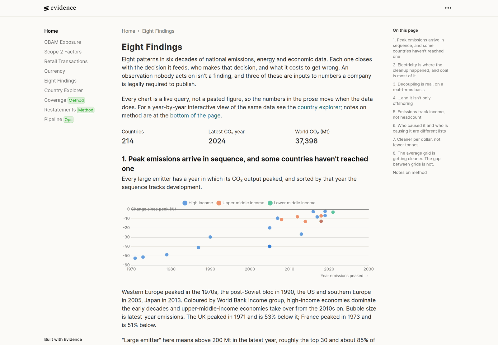

# A Public-Data Warehouse, Built End to End

*dlt → DuckDB → dbt → Polars → Evidence, orchestrated by Dagster. Rebuilt from
live sources on every push, and the warehouse itself is published, not just the
dashboard.*

[](https://github.com/Ddscully/dlt-dbt-duckdb-evidence/actions/workflows/ci.yml)
[](https://github.com/Ddscully/dlt-dbt-duckdb-evidence/actions/workflows/nightly.yml)
[](https://github.com/Ddscully/dlt-dbt-duckdb-evidence/actions/workflows/pages.yml)
[](https://github.com/Ddscully/dlt-dbt-duckdb-evidence/releases/latest)
[](./LICENSE)

### 📊 [**See the live dashboard →**](https://ddscully.github.io/dlt-dbt-duckdb-evidence/)

[](https://ddscully.github.io/dlt-dbt-duckdb-evidence/findings)
**A working data pipeline over seven public feeds, and a demonstration of the
practices that keep a warehouse trustworthy.** It runs end to end — ingestion,
modelling, tests, orchestration, a dashboard and a published data release — at
two grains that are usually two different projects, because the modelling
problems they pose are opposite.

- **Country-year**, the figures organisations are required to act on: the grid
  carbon intensity behind every company's Scope 2 disclosure (30 g/kWh in Norway
  against 717 in South Africa, a 24× spread on the same kilowatt-hour), what a
  tonne of imported steel will cost at the EU border from 2026, and what
  electricity actually costs in each EU market. Here the hard part is *coverage*:
  which country is missing from which series, and what a join quietly drops.
- **Transaction grain**, the questions annual averages cannot ask: one UK
  wholesaler's complete 1.07M-line invoice log. Revenue depends on telling a
  stock write-off from a customer return when both are a negative quantity;
  returns are matched to their sale by inference, because nothing links them.
  It is also the only source with a person in it, which is why
  [`docs/DATA_PROTECTION.md`](./docs/DATA_PROTECTION.md) exists.

The feeds are [Our World in Data](https://github.com/owid/co2-data), the
[World Bank](https://databank.worldbank.org/source/world-development-indicators),
[Eurostat](https://ec.europa.eu/eurostat), the [ECB](https://frankfurter.dev),
[Open-Meteo](https://open-meteo.com/) and
[UCI's Online Retail II](https://archive.ics.uci.edu/dataset/502/online+retail+ii),
plus one EU regulatory annex that arrives as a seed — cleaned, joined on ISO code
and year, and charted. [`docs/WAREHOUSE.md`](./docs/WAREHOUSE.md) has the grains
and schemas.

**👉 The practices are indexed in [`docs/PRACTICES.md`](./docs/PRACTICES.md)** —
each one with the failure it prevents, the number that measures it, and a link to
where it happens in the code. That is the shortest route into this repo if you
are reading it as work rather than running it.

No numbers are exported by hand. The whole thing rebuilds itself from the live
sources on every push, so the site is never more than a week behind what those
organisations publish, and every finding names the decision it feeds.

<sub>Nothing to install to look at the numbers, just follow the link above. The
rest of this README is for people who want to run or read the pipeline; if you
are evaluating it as work, [`docs/FOR_REVIEWERS.md`](./docs/FOR_REVIEWERS.md)
answers the SLA, run-cost and what-breaks-at-1000× questions directly.</sub>

---

The stack is deliberately **lightweight**. Everything runs locally with `uv`:
raw lands as Parquet in a DuckLake catalog, and dbt builds into a single DuckDB
file — no cloud warehouse, no credentials, no bill.

```
dlt  ─▶  DuckLake  ─▶  dbt  ─▶  Polars  ─▶  Evidence
 EL     raw Parquet   stg/marts   heavy T     BI-as-code
└──────────────────── Dagster ─────────────────────┘
             one asset graph, scheduled
```

## Stack

| Tool | Role |
|------|------|
| [**uv**](https://docs.astral.sh/uv/) | project & environment manager |
| [**dlt**](https://dlthub.com/) | EL: API/CSV ingestion into DuckLake w/ schema inference |
| [**DuckDB**](https://duckdb.org/) | in-process analytical warehouse: what dbt builds, in a single file |
| [**dbt**](https://docs.getdbt.com/) (`dbt-duckdb`) | T: staging + marts, tests, docs |
| [**Dagster**](https://dagster.io/) | orchestration: every layer as a software-defined asset |
| [**Polars**](https://pola.rs/) | heavy columnar transforms / window logic in Python |
| [**DuckLake**](https://ducklake.select/) | where `raw` lands: Parquet under a catalog in `data/lakehouse/`, with snapshot lineage you can diff |
| [**Evidence**](https://evidence.dev/) | BI-as-code dashboard, deployable to GitHub Pages |
| [**sqlfluff**](https://sqlfluff.com/) + pre-commit | SQL linting / CI rigor |
| [**pytest**](https://docs.pytest.org/) | unit tests over the ingest/transform logic |
| **GitHub Actions** | fixture-backed pipeline run on every PR, live run nightly |

Want this shape for your own dataset?
[`docs/REUSING_THIS_STACK.md`](./docs/REUSING_THIS_STACK.md) covers what copies
over unchanged, what has to be rewritten, and the four decisions that are
expensive to revisit later.

## Orchestration

`just run` chains the steps in a shell; Dagster models the same pipeline as one
asset graph, which is what lets you rebuild only what a change touched.

```bash
just dagster                              # UI on :3000: graph, runs, freshness, checks
just materialize                          # whole graph, headless
just materialize-select 'raw/wb_wdi*'     # one source + everything downstream
just backfill-wdi 1990 1995               # re-load WDI for a range of years
```

Nothing declares the order by hand: dlt resource keys match the source keys
dagster-dbt derives from `_sources.yml`, the model edges come from dbt's own
`ref()` graph, and the site declares one dep per table its queries read. The
graph, the three jobs and the partitioned backfill are
[`docs/ORCHESTRATION.md`](./docs/ORCHESTRATION.md).

## The docs

The README is the tour. The detail lives here:

| | |
|---|---|
| [`docs/PRACTICES.md`](./docs/PRACTICES.md) | **the practices this repo demonstrates, and where each one is in the code** |
| [`docs/WAREHOUSE.md`](./docs/WAREHOUSE.md) | the seven sources, their grains, the schemas they land in, and the Parquet lake beside them |
| [`docs/ORCHESTRATION.md`](./docs/ORCHESTRATION.md) | the Dagster asset graph, the three jobs, backfills and freshness policies |
| [`docs/DATA_QUALITY.md`](./docs/DATA_QUALITY.md) | the 460 dbt tests, the mart-model contracts, and the groups, exposures and model versions around them |
| [`docs/DASHBOARD.md`](./docs/DASHBOARD.md) | the eleven dashboard pages, what each is for, and how the site is deployed |
| [`docs/PUBLISHED_DATA.md`](./docs/PUBLISHED_DATA.md) | the monthly data release and how to query it without cloning anything |
| [`docs/DATA_PROTECTION.md`](./docs/DATA_PROTECTION.md) | the one personal column: how it is classified, what the release does to it, and how identifiable a customer stays without it |
| [`docs/FOR_REVIEWERS.md`](./docs/FOR_REVIEWERS.md) | SLA, run cost, what breaks at 1000×, what I'd do differently |
| [`docs/REUSING_THIS_STACK.md`](./docs/REUSING_THIS_STACK.md) | what carries over to a different dataset, and the decisions that are expensive to revisit |

And [`docs/course/`](./docs/course/) teaches the same warehouse as material for
analytics engineers, built around the failures that stay green — a one-word join
edit that drops two thirds of the countries with all 460 tests still passing.
Modules 00–04 are written; 05–10 are outlined in the course index.

Plus [`docs/STYLE_GUIDE.md`](./docs/STYLE_GUIDE.md) for SQL conventions,
[`tests/README.md`](./tests/README.md) for the two test tiers,
[`reports/README.md`](./reports/README.md) for the Evidence layer, and
[`CLAUDE.md`](./CLAUDE.md) for every gotcha that cost more than an hour —
including the directory-by-directory map of what each layer is for. Working on
this with an AI agent: `.claude/settings.json` declares the official skill
plugins for the stack and `.claude/skills/` adds project-specific ones for the
seams the vendor skills can't know about ([CLAUDE.md](./CLAUDE.md#agent-skills)).

## Quickstart

Two things to install first. [uv](https://docs.astral.sh/uv/) manages Python and
every dependency here; `just` runs the recipes.

```bash
curl -LsSf https://astral.sh/uv/install.sh | sh   # or `brew install uv`
uv tool install rust-just                         # the `just` command runner
```

Then:

```bash
just setup      # uv sync runtime + dev + orchestration groups
just run        # ingest -> dbt build -> polars transform
just dagster    # ...or the same pipeline as an asset graph, UI on :3000
just sql        # poke around the warehouse in the DuckDB CLI
just report     # build the Evidence dashboard (needs Node ≥ 18)
```

No credentials at any point — every source is a public endpoint, and uv reads
`.python-version` and fetches CPython 3.13 itself if you haven't got it. The
whole asset graph *including* the site took **3 minutes** here from a cold cache
and `just run` alone is ~95 s; budget **~2.5 GB** on disk once built, all of it
gitignored and regenerable (`just clean`, or `just clean deep` to drop
`node_modules` too).

**On a plane, or don't want to hit seven public APIs?** `just test-pipeline` runs
the entire pipeline offline in ~30 s against recorded fixtures, into a throwaway
warehouse — it is what CI runs. `just course-sandbox` does the same into a
warehouse that persists, which is what the course exercises are built to break.

No `just`? The recipes map to plain commands; see the [`justfile`](./justfile).

## Tests

```bash
just test           # pytest: mocked payloads, no network, ~14s
just coverage       # the same, with line + branch coverage; gates nothing
just test-pipeline  # the whole pipeline against recorded fixtures, ~30s
```

CI on a pull request runs both, plus the Dagster asset graph and the asset
checks, entirely offline — so a red build means *this repo* broke, not that a
publisher was rate-limiting. A nightly workflow runs the same graph against the
live endpoints and opens an issue when a source has moved, which is the cue to
`just record-fixtures`. Contributors should run `uv run pre-commit install` once;
CI runs the same hooks over every file. Details in
[`tests/README.md`](./tests/README.md).

Alongside them, `just dbt-build` runs 490 tests — 460 data tests and 30 unit
tests — and enforces a schema contract on every mart model. What each gate catches is
[`docs/DATA_QUALITY.md`](./docs/DATA_QUALITY.md); why the gates are shaped that
way is [`docs/PRACTICES.md`](./docs/PRACTICES.md).

## Published dashboard

### 👉 [ddscully.github.io/dlt-dbt-duckdb-evidence](https://ddscully.github.io/dlt-dbt-duckdb-evidence/)

Eleven pages built from the modelled layers, deployed by
`.github/workflows/pages.yml` as a single Dagster job — the site is a node in the
asset graph, so the workflow materializes it rather than running npm itself. It
builds against the **live** sources, because a published dashboard showing the
17-country test slice would be worse than none. What is on each page, and the
three deployment things nobody tells you about, are in
[`docs/DASHBOARD.md`](./docs/DASHBOARD.md).

## Published data

### 👉 [Latest snapshot](https://github.com/Ddscully/dlt-dbt-duckdb-evidence/releases/latest)

The dashboard is one consumer of the warehouse. The warehouse itself is published
monthly, so you can use the joined data without running any of this: the whole
DuckDB file, the DuckLake landing zone beside it, a Parquet per modelled table,
row counts and checksums. DuckDB will query it over HTTPS where it sits, without
downloading anything.

[`docs/PUBLISHED_DATA.md`](./docs/PUBLISHED_DATA.md) has the queries and the four
things worth knowing before you build on it.

## License

Code is [MIT](./LICENSE). The data is not this project's to license: OWID's
[CO₂](https://github.com/owid/co2-data) and
[energy](https://github.com/owid/energy-data) datasets are CC BY 4.0, World Bank
WDI is CC BY 4.0, Eurostat data carries its own
[reuse policy](https://ec.europa.eu/eurostat/help/copyright-notice), the
CBAM default values are EU law, reusable under
[Decision 2011/833/EU](https://eur-lex.europa.eu/eli/dec/2011/833/oj), the
euro reference rates are the ECB's, under its
[reuse policy](https://www.ecb.europa.eu/services/using-our-site/disclaimer/html/index.en.html),
[UCI's Online Retail II](https://archive.ics.uci.edu/dataset/502/online+retail+ii)
(Chen, D., 2019) is CC BY 4.0, and the daily capital-city weather comes from
[Open-Meteo](https://open-meteo.com/) under CC BY 4.0, generated using Copernicus
Climate Change Service information (ECMWF ERA5).

Two licence decisions shaped the warehouse rather than just its paperwork — one
source left out entirely, and one whose data licence and API terms are different
documents. Both are in
[`docs/PRACTICES.md`](./docs/PRACTICES.md#6-the-boundary-outward).

All six permit redistribution with attribution, which is what the data releases
rely on. Every one ships an `ATTRIBUTION.md` naming the publisher and licence per
source. Attribute them, not this repo, for the numbers; the joins and derived
metrics are the only part that's ours. Nothing upstream is redistributed in the
repository *itself*: the pipeline fetches it at run time, and the checked-in
fixtures under `tests/fixtures/ingest/` are small excerpts kept for offline
testing.
